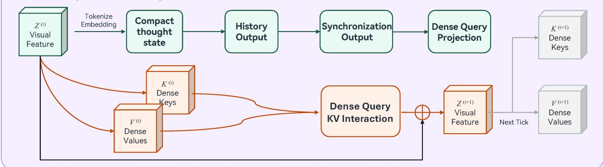

# Sparse Attention at a Million Tokens

Transformer attention costs $O(n^2)$ in sequence length, which is why a context
window is a budget rather than a setting. This note walks the block-sparse
variant that made a one-million-token window affordable on one node.

## The cost that forces the design

Dense attention over $n$ tokens materialises an $n \times n$ score matrix:

$$A = \mathrm{softmax}\left(\frac{QK^{\top}}{\sqrt{d}}\right)V$$

At $n = 10^6$ and fp16 that matrix alone is two terabytes, so nothing about the
approach survives contact with a long document.

## Block sparsity

The fix is to compute the matrix only where it is not nearly zero. Tokens are
grouped into blocks of 128, and a block pair is evaluated only when a cheap
router predicts it matters. The router is a single linear layer over block
means, which costs a rounding error next to the attention it skips.

## What it costs in quality

| Model | Context | Perplexity | Tokens/s |
| --- | --- | --- | --- |
| Dense baseline | 32k | 6.41 | 1800 |
| Block-sparse | 128k | 6.48 | 1740 |
| Block-sparse | 1M | 6.55 | 1610 |

Perplexity moves by about one percent across a thirty-fold increase in context,
and throughput holds because the skipped blocks were never the bottleneck.

## Where it breaks

Retrieval tasks that depend on a single distant token are the failure mode: the
router has to decide a block matters before anything has read it. On a
needle-in-a-haystack probe at one million tokens, recall falls from 99% to 84%
when the needle sits inside a block the router scores low.

## What to take away

Sparsity here is a statement about what attention actually attends to, not a
compression trick. The window grew thirty-fold for a one percent quality cost,
and the one place it fails is the one place the router has no evidence.
